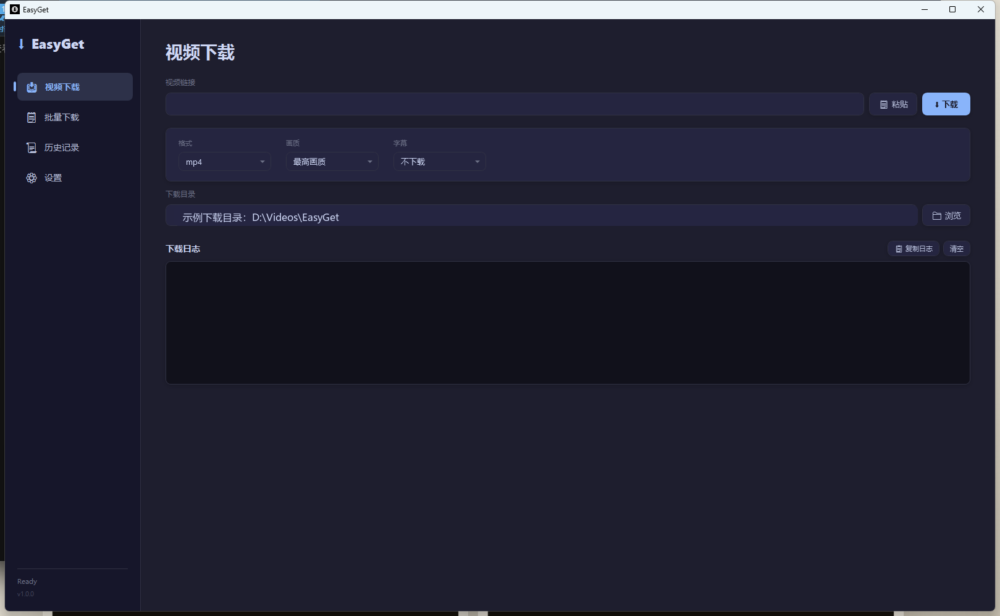
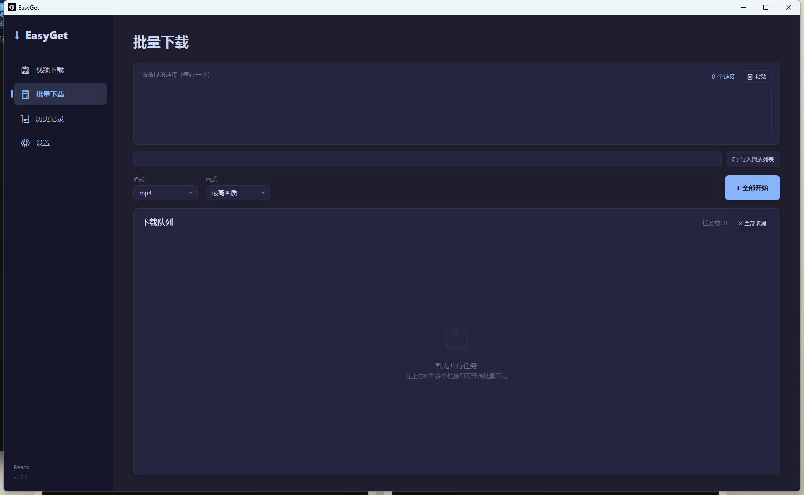
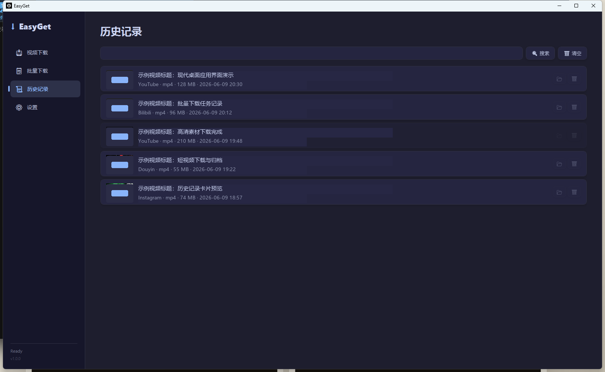
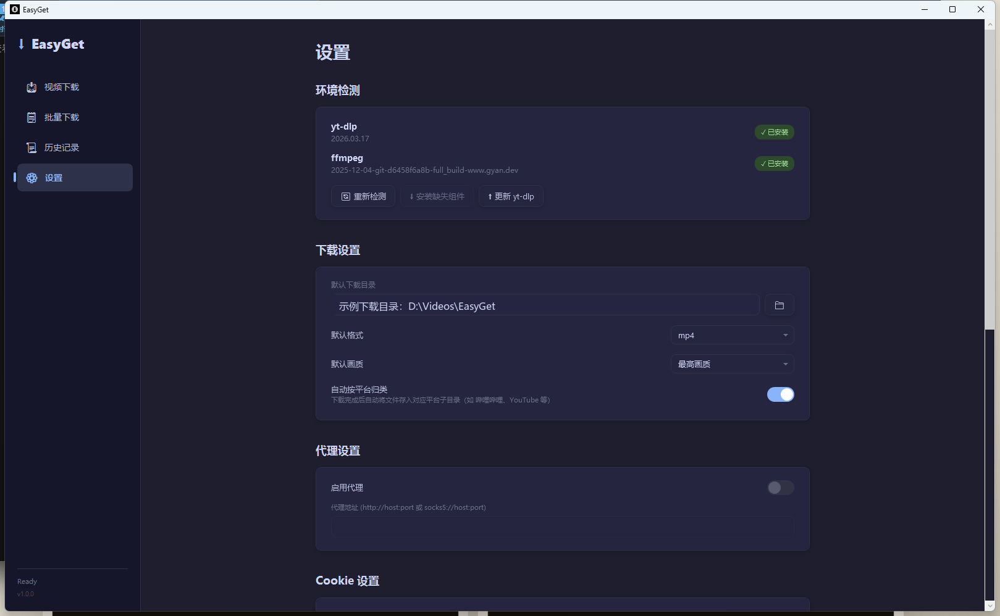

<p align="center">
  
</p>

<h1 align="center">EasyGet</h1>

<p align="center">
  <strong>基于 yt-dlp 的全平台视频下载桌面工具</strong>
</p>

<p align="center">
  
  
  
  
  
</p>

---

## 📖 简介

EasyGet 是一款基于 [yt-dlp](https://github.com/yt-dlp/yt-dlp) 的 Windows 桌面视频下载工具，支持 YouTube、Bilibili、X(Twitter)、Instagram、抖音等 [1000+ 网站](https://github.com/yt-dlp/yt-dlp/blob/master/supportedsites.md) 的视频下载。项目采用 WPF + MVVM 架构，提供暗色主题、多任务队列、下载历史、Cookie 辅助下载、播放列表导入和环境自动安装等能力。

## 🖼️ 当前界面

以下截图基于当前版本截取，示例路径与历史内容已做脱敏处理。

| 视频下载 | 批量下载 |
|---|---|
|  |  |

| 历史记录 | 设置 |
|---|---|
|  |  |

## ✨ 功能特性

### 🎯 核心功能
- **单视频下载** — 输入 URL 后自动解析标题、平台、时长、缩略图，支持格式、画质、字幕与目录选择
- **批量下载** — 多 URL 批量输入，支持播放列表导入、队列管理、并发下载控制和单任务操作
- **任务控制** — 支持取消、暂停、恢复、失败重试、全部取消与已结束任务清理
- **下载历史** — SQLite 持久化存储，支持搜索、删除、清空、打开文件夹和缩略图展示
- **智能环境检测** — 启动时自动检测 yt-dlp / ffmpeg，缺失则从官方发布源自动下载安装，并支持在设置页手动重试与更新 yt-dlp

### ⚙️ 配置管理
- 默认下载路径、格式、画质设置
- HTTP / SOCKS5 代理支持
- 并发分片数与同时下载数调节，批量下载并发上限可动态更新
- aria2c 外部下载器开关
- Cookie 内容保存与转换，支持常见浏览器 Cookie 字符串、JSON 和 Netscape 格式
- 下载完成后按平台自动归类保存
- JSON 配置自动持久化

### 🎨 用户体验
- **Catppuccin Mocha** 暗色主题，精心定制的控件样式
- 侧边栏导航（下载 / 批量下载 / 历史 / 设置）
- 实时下载进度、速度、ETA 展示
- 剪贴板 URL 快速粘贴
- 下载完成、失败、取消后的应用内 Toast 通知
- yt-dlp 输出日志查看、复制与清空
- 全局异常捕获与崩溃日志

## 🏗️ 技术架构

```
EasyGet/
├── Models/                  # 数据模型层
│   ├── AppConfig.cs         #   应用配置模型
│   ├── DownloadTask.cs      #   下载任务模型（ObservableObject）
│   └── DownloadHistory.cs   #   下载历史记录模型
├── Services/                # 服务层（业务逻辑）
│   ├── ConfigService.cs     #   JSON 配置读写
│   ├── YtDlpService.cs      #   yt-dlp 命令封装（核心服务）
│   ├── DownloadManager.cs   #   下载队列与并发管理
│   ├── HistoryService.cs    #   SQLite 历史 CRUD
│   ├── EnvironmentService.cs#   环境检测、自动安装与 yt-dlp 更新
│   └── DownloadFileNameBuilder.cs # 下载文件名与输出模板构建
├── ViewModels/              # 视图模型层
│   ├── MainViewModel.cs     #   导航与全局状态
│   ├── DownloadViewModel.cs #   单视频下载逻辑
│   ├── BatchDownloadViewModel.cs # 批量下载逻辑
│   ├── HistoryViewModel.cs  #   历史记录逻辑
│   └── SettingsViewModel.cs #   设置页逻辑（自动保存）
├── Views/                   # 视图层（XAML）
│   ├── DownloadView.xaml    #   单视频下载页
│   ├── BatchDownloadView.xaml #  批量下载页
│   ├── HistoryView.xaml     #   历史记录页
│   └── SettingsView.xaml    #   设置页
├── Themes/
│   └── Generic.xaml         # Catppuccin Mocha 主题 + 控件样式
├── Converters/
│   └── CommonConverters.cs  # 值转换器（Bool/Visibility/Status 等）
├── EasyGet.Tests/           # 单元测试项目
├── App.xaml(.cs)            # DI 容器 / 全局异常捕获
└── MainWindow.xaml(.cs)     # 主窗口 + 侧边栏导航
```

### 技术栈

| 技术 | 用途 |
|---|---|
| **.NET 8 / WPF / C# 12** | 应用框架 |
| **CommunityToolkit.Mvvm** | MVVM 框架（源生成器） |
| **Microsoft.Extensions.DependencyInjection** | 依赖注入 |
| **Microsoft.Data.Sqlite** | 下载历史持久化 |
| **yt-dlp** | 视频下载核心引擎 |
| **ffmpeg** | 音视频合并转码 |
| **xUnit** | 单元测试 |

## 🚀 快速开始

### 环境要求

- Windows 10 / 11
- [.NET 8 SDK](https://dotnet.microsoft.com/download/dotnet/8.0)

### 构建与运行

```bash
# 克隆仓库
git clone https://github.com/zzf-857/EasyGet.git
cd EasyGet/EasyGet

# 还原依赖
dotnet restore

# 运行
dotnet run

# 运行测试
dotnet test EasyGet.Tests/EasyGet.Tests.csproj

# 发布并做 smoke 检查
powershell -NoProfile -ExecutionPolicy Bypass -File .\scripts\publish-win-x64.ps1 -SkipZip
```

> **提示：** 首次运行时，EasyGet 会自动检测并下载 yt-dlp 和 ffmpeg，无需手动安装。yt-dlp 来自官方 GitHub Release，ffmpeg Windows 构建来自 FFmpeg 官网链接的 gyan.dev。

## 📊 开发进度

### ✅ 已完成
- [x] MVVM 架构 + 依赖注入容器
- [x] 侧边栏四页导航
- [x] 单视频下载（URL 解析 / 格式选择 / 字幕选择 / 进度展示 / 取消）
- [x] 批量下载（多 URL / 播放列表导入 / 队列管理 / 单任务操作）
- [x] SQLite 历史记录（搜索 / 删除 / 清空 / 打开文件夹 / 缩略图）
- [x] 设置页（环境检测 / 路径 / 格式 / 代理 / Cookie / 性能）
- [x] yt-dlp / ffmpeg 自动检测与安装
- [x] yt-dlp 手动更新
- [x] aria2c 外部下载器参数集成
- [x] aria2c 可用性检测与不可用回退提示
- [x] 并发数动态调整
- [x] 下载暂停 / 恢复 / 取消 / 失败重试
- [x] 下载完成、失败、取消 Toast 通知
- [x] 缩略图解析与展示
- [x] Cookie 粘贴、转换与下载参数集成
- [x] 按平台自动归类保存
- [x] 抖音浏览器兜底下载
- [x] Catppuccin Mocha 暗色主题
- [x] 全局异常捕获 + 崩溃日志
- [x] JSON 配置持久化
- [x] 窗口位置 / 大小持久化
- [x] 日志自动滚动到底部
- [x] 剪贴板粘贴支持
- [x] 基础单元测试（文件命名、Cookie、环境辅助函数、XAML 绑定等）
- [x] Windows 发布脚本与 EasyGet.exe smoke 检查

### 🔧 待完善
- [ ] 系统托盘或系统级 Toast 通知
- [ ] 真实站点下载速度与异常场景端到端验证
- [ ] 抖音浏览器兜底的网络中断、Range 续传和取消清理测试
- [ ] 动态并发调整的服务级测试
- [ ] 更完整的 UI/UX 重构（暗色 Google Material 风格）
- [ ] 应用安装包（Inno Setup / MSIX）
- [ ] 应用自动更新
- [ ] 国际化支持
- [ ] 更完整的单元测试和 UI 自动化测试

## 📁 数据存储

| 数据 | 位置 |
|---|---|
| 配置文件 | `%LocalAppData%/EasyGet/config.json` |
| 下载历史 | `%LocalAppData%/EasyGet/history.db` (SQLite) |
| Cookie 转换文件 | `%LocalAppData%/EasyGet/cookies.txt` |
| 崩溃日志 | `<应用目录>/logs/crash_*.txt` |
| yt-dlp | `<应用目录>/tools/yt-dlp.exe` |
| ffmpeg | `<应用目录>/tools/ffmpeg.exe` |

## 🤝 贡献

欢迎提交 Issue 和 Pull Request！

## 📄 许可证

本项目基于 [MIT License](LICENSE) 开源。
