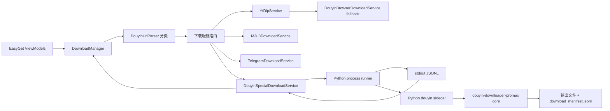

# EasyGet 抖音专项引擎集成设计

日期：2026-07-03  
角色：子代理 A，总体架构与接口契约

## 结论摘要

推荐采用 **混合方案：Python sidecar 作为抖音专项引擎，EasyGet C# 侧只做进程管理、stdout JSONL 解析、队列状态桥接和兜底路由**。

不建议第一期 C# 重写 `douyin-downloader-promax` 核心逻辑。第三方项目已经覆盖抖音 Web API 签名、短链解析、无水印视频源选择、图文资源选择、用户 post 分页、重试、速率限制、SQLite/本地去重和下载清单，核心文件集中在 `F:\AI\AIMadeupTools\05_ThirdPartyRepos\GitRepositories\douyin-downloader-promax\core\api_client.py`、`core\downloader_base.py`、`core\video_downloader.py`、`core\user_downloader.py`、`core\user_modes\post_strategy.py`。C# 重写会把反爬签名、分页异常、图文/实况图资源选择等高波动逻辑重新暴露给 EasyGet。

协调更新：EasyGet 侧已经新增 URL parser 和 C# sidecar client。当前最小落地契约应以 **C# client 已支持的 stdout JSONL** 为准；第三方 `server\app.py` 仍可作为后续常驻 REST sidecar 原型参考，但不能原样接入。

## 阅读依据

EasyGet 侧重点文件：

- `F:\AI\AIMadeupTools\01_DesktopApps\EasyGet\README.md`
- `F:\AI\AIMadeupTools\01_DesktopApps\EasyGet\Models\AppConfig.cs`
- `F:\AI\AIMadeupTools\01_DesktopApps\EasyGet\Models\DownloadTask.cs`
- `F:\AI\AIMadeupTools\01_DesktopApps\EasyGet\Services\DownloadManager.cs`
- `F:\AI\AIMadeupTools\01_DesktopApps\EasyGet\Services\YtDlpService.cs`
- `F:\AI\AIMadeupTools\01_DesktopApps\EasyGet\Services\DouyinBrowserDownloadService.cs`
- `F:\AI\AIMadeupTools\01_DesktopApps\EasyGet\ViewModels\BatchDownloadViewModel.cs`
- `F:\AI\AIMadeupTools\01_DesktopApps\EasyGet\ViewModels\SettingsViewModel.cs`

第三方项目重点文件：

- `F:\AI\AIMadeupTools\05_ThirdPartyRepos\GitRepositories\douyin-downloader-promax\PROJECT_SUMMARY.md`
- `F:\AI\AIMadeupTools\05_ThirdPartyRepos\GitRepositories\douyin-downloader-promax\README.zh-CN.md`
- `F:\AI\AIMadeupTools\05_ThirdPartyRepos\GitRepositories\douyin-downloader-promax\core\api_client.py`
- `F:\AI\AIMadeupTools\05_ThirdPartyRepos\GitRepositories\douyin-downloader-promax\core\url_parser.py`
- `F:\AI\AIMadeupTools\05_ThirdPartyRepos\GitRepositories\douyin-downloader-promax\core\downloader_base.py`
- `F:\AI\AIMadeupTools\05_ThirdPartyRepos\GitRepositories\douyin-downloader-promax\core\user_downloader.py`
- `F:\AI\AIMadeupTools\05_ThirdPartyRepos\GitRepositories\douyin-downloader-promax\core\video_downloader.py`
- `F:\AI\AIMadeupTools\05_ThirdPartyRepos\GitRepositories\douyin-downloader-promax\core\user_modes\post_strategy.py`
- `F:\AI\AIMadeupTools\05_ThirdPartyRepos\GitRepositories\douyin-downloader-promax\server\app.py`
- `F:\AI\AIMadeupTools\05_ThirdPartyRepos\GitRepositories\douyin-downloader-promax\server\jobs.py`

## 现状判断

EasyGet 当前下载链路由 `Services\DownloadManager.cs` 管理队列、并发、任务状态和历史写入。它在入队后先调用 `YtDlpService.GetVideoInfoAsync()` 解析元数据，再按 URL 类型分发到 m3u8、Telegram 或 `YtDlpService.DownloadAsync()`。`Models\DownloadTask.cs` 已经包含本次契约需要承接的字段：`Status`、`Progress`、`Speed`、`Eta`、`DownloadedSize`、`OutputFilePath`、`ErrorMessage`、`Cts`。

`Services\DouyinUrlParser.cs` 已新增，职责边界应保持很窄：**只识别分类，不下载、不展开短链、不调用 sidecar**。当前识别 `short`、`video`、`note`、`gallery`、`slides`、`user`、`collection`、`mix`、`music`、`live`；其中 `short`、`video`、`note`、`gallery`、`slides`、`user`、`collection`、`mix`、`music` 会进入专项下载候选，`live` 仍返回当前暂不支持的清晰错误。

`Services\DouyinSpecialDownloadService.cs` 已新增 C# sidecar client 雏形，当前通过启动 Python 脚本、读取 stdout JSONL、映射 `progress` / `success` / `failed` / `cancelled` / `log` 事件来更新 `DownloadTask`。后续 Python sidecar 原型需要优先匹配这个 stdout JSONL 契约。

`Services\YtDlpService.cs` 已经有抖音识别、Cookie 策略和失败后的 `DouyinBrowserDownloadService` 兜底。该兜底通过 Chrome/Edge CDP 捕获 mp4 响应，只适合单视频兜底，不覆盖图文和用户 post 批量。

`Services\DouyinBrowserDownloadService.cs` 当前只支持 mp4，依赖本机 Chrome/Edge，按单文件下载并回填 `DownloadTask`。它应保留为 fallback，而不是扩展成主引擎。

第三方项目的 `core\downloader_base.py` 已经能够区分视频和图文，优先无水印视频源，图文优先无水印/原图字段，并写入 `download_manifest.jsonl`。`core\user_downloader.py` 和 `core\user_modes\post_strategy.py` 已经能做用户 post 批量、分页、数量限制、时间过滤、去重和 post 浏览器回补。`server\app.py` 已经证明可以通过 FastAPI 暴露后台 job，但 `server\jobs.py` 当前 job 状态只有 `pending/running/success/failed`，没有取消和事件流。

## 方案比较

### 方案 A：Python sidecar

优点：

- 最大化复用第三方项目中已验证的抖音 API、签名、短链、分页、图文和用户 post 逻辑。
- 与 EasyGet 现有 yt-dlp 主链路隔离，抖音 API 波动不会污染通用下载逻辑。
- 便于后续扩展评论、直播、收藏夹、转写等第三方已有能力。

缺点：

- 需要解决 Windows 打包、Python 运行时、依赖安装、sidecar 生命周期和进程异常处理。
- 当前 REST server 契约不足；若后续做常驻服务，需要补取消、事件、输出路径和错误模型。
- 进度主要是按作品计数，不是像 yt-dlp 那样稳定的字节级进度。

### 方案 B：C# 重写

优点：

- 单进程、单语言，部署和调试路径最短。
- 可直接复用 EasyGet 的配置、日志、取消令牌、文件命名和历史记录。

缺点：

- 需要重写 `X-Bogus` / `a_bogus` / msToken / Cookie 清洗 / 分页风控 / 图文资源选择等高变化逻辑。
- 图文、实况图、用户 post 回补和无水印选择的边界非常多，短期回归风险高。
- 后续评论、直播、收藏夹等能力也要继续重写，长期维护成本最高。

### 方案 C：混合方案

优点：

- Python sidecar 负责抖音专项能力，C# 保持 EasyGet 的任务队列、UI、历史、配置和兜底体验。
- C# 侧只实现稳定契约：URL 分类、启动进程、读取 stdout JSONL、取消进程、日志事件/状态映射。
- 保留 `YtDlpService` 和 `DouyinBrowserDownloadService` 作为降级路径。

缺点：

- 需要定义清楚 sidecar 契约，避免 Python 和 C# 两边并行开发时字段漂移。
- 需要主代理协调 Python sidecar 原型严格输出 C# client 已接受的 JSONL 字段，避免再引入第二套状态枚举。

推荐方案 C。

## 一期能力边界

第一期纳入：

- 抖音单视频：`/video/{aweme_id}`、含 `modal_id` 的作品链接、`v.douyin.com` / `v.iesdouyin.com` 短链解析后的单作品。
- 抖音图文：`/note/{id}`、`/gallery/{id}`、`/slides/{id}`，下载图片；如第三方识别为实况图，可把 live photo mp4 作为附加输出。
- 用户主页批量：`/user/{sec_uid}`，支持 `mode: ["post"]`、`["like"]`、`["mix"]`、`["music"]`；本人收藏页支持 `["collect"]`、`["collectmix"]`；支持 `maxItems`，可预留 `startDate` / `endDate`。
- 抖音合集/音乐类单链接：`/collection/{id}`、`/mix/{id}`、`/music/{id}`，交由第三方 sidecar 的 downloader factory 分发。
- Cookie、代理、输出目录、并发数沿用 EasyGet 设置。
- 输出 `download_manifest.jsonl`，用于回传多文件路径和批量结果。

第一期不纳入：

- 评论采集。
- 直播录制。
- 视频转写。
- 热榜、关键词搜索。
- 关注列表同步、通知推送、数据库浏览器、文件归档管理。
- 暂停/恢复。第一期只支持取消和重试；EasyGet 对 sidecar 任务应隐藏暂停/恢复，或让暂停按钮退化为取消但 UI 文案必须明确。

第一期默认资源策略：

- 单视频：下载主 mp4；不下载音乐、头像、封面 JSON 等附加资源，避免 EasyGet 历史里出现用户未预期的文件。
- 图文：下载图片资源；实况图 mp4 可作为附加文件返回。
- 用户 post：下载每个作品的主媒体资源；默认不下载封面、音乐、头像、原始 JSON。`download_manifest.jsonl` 仍保留。

第三方配置对应建议：

- `music: false`
- `cover: false`
- `avatar: false`
- `json: false`
- `folderstyle: true`
- `mode: ["post"]`，用户可切换到 `like` / `mix` / `music`
- `database: true` 可保留用于去重；若担心 EasyGet 历史与第三方 SQLite 双写，可先设为 `false`，只依赖本地文件和 manifest。
- `comments.enabled: false`
- `transcript.enabled: false`
- `notifications.enabled: false`
- `browser_fallback.enabled: false` 可作为最小打包默认值；若主代理决定一并打包 Playwright，则可开启用户 post 回补。

## 总体架构



已完成/需对齐边界：

- `Services\DouyinUrlParser.cs`：只做 URL 分类和 ID 提取，不展开短链、不下载、不调用 sidecar。
- `Services\DouyinSpecialDownloadService.cs`：C# 下载服务适配器，启动 Python sidecar 脚本，逐行解析 stdout JSONL，并映射到 `DownloadTask`。
- Python sidecar 原型应优先输出 stdout JSONL；后续若要常驻服务，可再参考第三方 `server\app.py`、`server\jobs.py` 扩展 REST API。

`Services\DownloadManager.cs` 的分发策略建议：

1. m3u8 和 Telegram 保持现状。
2. 先调用 `DouyinUrlParser.Parse()`；只用解析结果做路由判断，不在 parser 中做网络请求。
3. `ShortLink`、`Video`、`Note`、`Gallery`、`Slides`、`User`、`Collection`、`Mix`、`Music` 进入抖音专项候选；短链展开由 Python sidecar 或现有下载器负责。
4. `Live` 已能被 parser 识别，但当前不纳入专项下载；应给出“当前暂不支持”的明确提示。
5. sidecar 脚本缺失、进程启动失败时，单视频回落到 `YtDlpService.DownloadAsync()` 和现有 `DouyinBrowserDownloadService`。
6. 用户 post 批量和图文若 sidecar 不可用，应给出结构化错误，不静默回落到 yt-dlp。

Task B 接线结果：

- `EnableDouyinSpecialEngine=false`：保持旧流程，抖音 URL 仍先走 `YtDlpService.GetVideoInfoAsync()` 再由 yt-dlp 下载。
- `EnableDouyinSpecialEngine=true` 且 kind 为 `ShortLink`、`Video`、`Note`、`Gallery`、`Slides`、`User`、`Collection`、`Mix`、`Music`：`DownloadManager` 在元数据解析前短路，填充 `Platform=Douyin` 和稳定兜底标题，并按 `AutoCategorizeByPlatform` 归类到 `抖音`。
- 上述支持 kind 下载时调用 `IDouyinSpecialDownloadService.DownloadAsync(task, config, ...)`。
- `Live` 在专项开启时明确失败为“当前暂不支持”，不回落 yt-dlp。
- sidecar 基础设施不可用时，仅 `ShortLink` / `Video` 回落 yt-dlp；`Note` / `Gallery` / `Slides` / `User` / `Collection` / `Mix` / `Music` 保持失败。

## Sidecar 契约

基础约定：

- 一期主契约是 stdout JSONL：Python sidecar 每输出一行，必须是一条完整且独立的 JSON object。
- stdout 只输出机器可读 JSONL；人类可读诊断日志如不能包装为 `{"event":"log"}`，应写到 stderr。
- 时间：UTC ISO-8601，例如 `2026-07-03T06:12:30.000Z`。
- 路径统一返回 Windows 绝对路径。
- Cookie 不在响应中回显；日志和错误详情必须脱敏。

### stdout JSONL 一期契约

C# client 当前以 `event` 字段识别事件类型；为避免字段漂移，Python sidecar 原型应优先输出以下五类事件：

- `progress`
- `success`
- `failed`
- `cancelled`
- `log`

`progress` 行：

```json
{"event":"progress","percent":45.0,"downloaded_bytes":10485760,"total_bytes":20971520,"speed_bytes_per_sec":524288,"eta_seconds":20}
```

字段说明：

- `percent`：0-100，可由作品计数或字节进度估算。
- `downloaded_bytes`：已下载字节数；未知时可为 `0` 或省略。
- `total_bytes`：总字节数；未知时可为 `0` 或省略。
- `speed_bytes_per_sec`：下载速度；未知时可为 `0` 或省略。
- `eta_seconds`：预计剩余秒数；未知时可为 `0` 或省略。

`success` 行：

```json
{"event":"success","title":"作品标题","platform":"Douyin","duration_seconds":0,"thumbnail_url":"","file_size_bytes":12345678,"output_file_path":"D:\\Downloads\\EasyGet\\抖音\\作者\\2026-07-03_作品标题_7604129988555574538\\2026-07-03_作品标题_7604129988555574538.mp4"}
```

字段说明：

- `title`：用于回填 `DownloadTask.Title`。
- `platform`：建议固定为 `Douyin`。
- `duration_seconds`：未知时为 `0`。
- `thumbnail_url`：未知时为空字符串。
- `file_size_bytes`：主输出文件大小；图文/批量可用 primary 文件或汇总值，至少不应为负数。
- `output_file_path`：单视频为主 mp4；图文/用户 post 批量建议为作品目录、用户目录或 manifest 路径，需与主代理的历史策略保持一致。

`failed` 行：

```json
{"event":"failed","error":"抖音 Cookie 已失效或权限不足，请在设置中更新 Cookie 后重试。","title":"作品标题","platform":"Douyin"}
```

失败摘要必须优先填 `error`。如果同时存在 `message`、`detail`、`reason`，C# client 可作为兜底展示，但 Python sidecar 不应只输出这些字段而省略 `error`。

`cancelled` 行：

```json
{"event":"cancelled","message":"用户已取消任务"}
```

`log` 行：

```json
{"event":"log","message":"已抓取 20 条作品"}
```

兼容性说明：

- 当前 C# client 也能容忍 `type` / `status` 替代 `event`，并能从 `summary` / `progress` 嵌套对象读取字段；但 Python sidecar 新实现应使用上面的扁平 snake_case 字段。
- 每个进程至少输出一个终态事件：`success`、`failed` 或 `cancelled`。进程退出码非 0 且没有终态 JSONL 时，C# 侧会把 stderr 当作失败原因。
- 短链展开、真实下载和错误判定属于 Python sidecar，不属于 `DouyinUrlParser`。

### REST API 后续契约（可选）

如后续将 Python sidecar 改为常驻本地服务，可在 stdout JSONL 稳定后再引入 REST API。以下接口保留为长期目标，不是当前 C# client 的一期必需路径。

REST 基础约定：

- 监听地址：`127.0.0.1:{dynamicPort}`，端口由 C# 侧启动时分配或从 sidecar stdout 读取。
- Content-Type：`application/json; charset=utf-8`。
- job 状态保留至少 24 小时或直到 EasyGet 关闭 sidecar。

### 健康检查

`GET /api/v1/health`

响应：

```json
{
  "status": "ok",
  "version": "2.0.0-easyget",
  "capabilities": ["single_video", "gallery", "user_post"],
  "unsupported": ["comments", "live", "transcript", "hot_board", "favorites"],
  "python": "3.11.9",
  "workDir": "%LocalAppData%\\EasyGet\\tools\\douyin-sidecar"
}
```

### 提交任务

`POST /api/v1/jobs`

请求：

```json
{
  "clientTaskId": "easyget-download-task-id",
  "url": "https://www.douyin.com/video/7604129988555574538",
  "outputDirectory": "D:\\Downloads\\EasyGet\\抖音",
  "kind": "auto",
  "options": {
    "quality": "highest",
    "maxItems": 0,
    "mode": ["post"],
    "mediaTypes": ["video", "gallery"],
    "includeCover": false,
    "includeMusic": false,
    "includeAvatar": false,
    "includeJson": false,
    "startDate": "",
    "endDate": ""
  },
  "runtime": {
    "proxy": "",
    "cookieRef": "easyget-default",
    "concurrency": 3
  }
}
```

字段说明：

- `kind` 可取 `auto`、`single_video`、`gallery`、`user_post`。若 C# 侧已经通过 `DouyinUrlParser` 分类，可把 `Video` 映射为 `single_video`，`Note` / `Gallery` / `Slides` 映射为 `gallery`，`User` 映射为 `user_post`；`ShortLink` 可传 `auto`，由 Python sidecar 展开后再判定。
- `quality` 从 EasyGet `DefaultQuality` 映射：`best -> highest`、`2160 -> highest`、`1080 -> 1080p`、`720 -> 720p`、`480 -> 480p`。
- `mode` 支持 `post`、`like`、`mix`、`music`，仅用户 URL 生效。
- `maxItems = 0` 表示不限；用户 post 建议 UI 以后提供显式上限，避免误下全量。
- `cookieRef` 表示 sidecar 读取 C# 写入的 sidecar 配置或 cookie 文件，不通过 HTTP 明文传输 Cookie。

响应：

```json
{
  "jobId": "dy_8f62b3c948e1",
  "clientTaskId": "easyget-download-task-id",
  "status": "queued",
  "acceptedAt": "2026-07-03T06:12:30.000Z"
}
```

### 查询状态

`GET /api/v1/jobs/{jobId}`

响应：

```json
{
  "jobId": "dy_8f62b3c948e1",
  "clientTaskId": "easyget-download-task-id",
  "url": "https://www.douyin.com/video/7604129988555574538",
  "kind": "single_video",
  "status": "running",
  "phase": "downloading",
  "createdAt": "2026-07-03T06:12:30.000Z",
  "startedAt": "2026-07-03T06:12:31.000Z",
  "finishedAt": null,
  "progress": {
    "percent": 45.0,
    "totalItems": 1,
    "completedItems": 0,
    "success": 0,
    "failed": 0,
    "skipped": 0,
    "downloadedBytes": null,
    "totalBytes": null,
    "speedBytesPerSecond": null,
    "etaSeconds": null,
    "currentItem": {
      "awemeId": "7604129988555574538",
      "title": "作品标题",
      "mediaType": "video"
    }
  },
  "outputs": [],
  "error": null,
  "lastEventSeq": 18
}
```

终态响应需包含输出：

```json
{
  "jobId": "dy_8f62b3c948e1",
  "status": "completed",
  "phase": "completed",
  "progress": {
    "percent": 100,
    "totalItems": 1,
    "completedItems": 1,
    "success": 1,
    "failed": 0,
    "skipped": 0
  },
  "outputs": [
    {
      "path": "D:\\Downloads\\EasyGet\\抖音\\作者\\2026-07-03_作品标题_7604129988555574538\\2026-07-03_作品标题_7604129988555574538.mp4",
      "kind": "video",
      "awemeId": "7604129988555574538",
      "mediaType": "video",
      "bytes": 12345678,
      "primary": true
    }
  ],
  "manifestPath": "D:\\Downloads\\EasyGet\\抖音\\download_manifest.jsonl",
  "error": null,
  "lastEventSeq": 42
}
```

状态枚举：

- `queued`
- `resolving`
- `listing`
- `running`
- `finalizing`
- `completed`
- `failed`
- `cancelled`

EasyGet 映射：

| Sidecar status | EasyGet `DownloadStatus` |
|---|---|
| `queued` | `Waiting` |
| `resolving` / `listing` | `Resolving` |
| `running` | `Downloading` |
| `finalizing` | `Downloading` 或 `Merging`，第一期建议仍用 `Downloading` |
| `completed` | `Completed` |
| `failed` | `Failed` |
| `cancelled` | `Cancelled` |

### 取消任务

`POST /api/v1/jobs/{jobId}/cancel`

响应：

```json
{
  "jobId": "dy_8f62b3c948e1",
  "status": "cancelled",
  "cancelRequestedAt": "2026-07-03T06:13:10.000Z"
}
```

取消语义：

- 对 `queued` job：直接转 `cancelled`。
- 对 `running` job：取消 asyncio task，停止后续下载，清理 `.tmp` / `.part` 临时文件。
- 已完成或失败 job：返回当前终态，不再改变输出。
- 当前第三方 `server\jobs.py` 没有取消能力，Python sidecar 原型需要新增 cancellable job manager。

### 事件/日志轮询

`GET /api/v1/jobs/{jobId}/events?after={seq}&limit=200`

响应：

```json
{
  "jobId": "dy_8f62b3c948e1",
  "events": [
    {
      "seq": 19,
      "time": "2026-07-03T06:12:32.000Z",
      "type": "state",
      "level": "info",
      "message": "开始解析抖音链接",
      "data": {
        "status": "resolving",
        "phase": "resolving"
      }
    },
    {
      "seq": 20,
      "time": "2026-07-03T06:12:35.000Z",
      "type": "progress",
      "level": "info",
      "message": "已抓取 20 条作品",
      "data": {
        "percent": 20,
        "totalItems": 50,
        "completedItems": 0
      }
    },
    {
      "seq": 21,
      "time": "2026-07-03T06:12:41.000Z",
      "type": "output",
      "level": "info",
      "message": "文件已保存",
      "data": {
        "path": "D:\\Downloads\\EasyGet\\抖音\\作者\\post\\2026-07-03_作品标题_7604129988555574538\\2026-07-03_作品标题_7604129988555574538.mp4",
        "kind": "video",
        "awemeId": "7604129988555574538"
      }
    }
  ],
  "nextSeq": 22,
  "truncated": false
}
```

事件类型：

- `state`：状态变化。
- `log`：普通日志。
- `progress`：进度快照。
- `item`：单作品开始、成功、失败、跳过。
- `output`：新增输出文件。
- `error`：结构化错误。

REST 模式建议 C# 每 300-500 ms 轮询一次事件和状态。SSE 可作为后续优化，不作为 stdout JSONL 一期最小契约。

### 错误模型

所有失败终态使用同一结构：

```json
{
  "code": "DOUYIN_COOKIE_REQUIRED",
  "message": "抖音 Cookie 已失效或权限不足，请在设置中更新 Cookie 后重试。",
  "detail": "login required at /aweme/v1/web/aweme/post/",
  "retryable": true,
  "stage": "listing",
  "rawType": "LoginRequiredError"
}
```

建议错误码：

- `DOUYIN_UNSUPPORTED_URL`
- `DOUYIN_SHORT_URL_RESOLVE_FAILED`
- `DOUYIN_COOKIE_REQUIRED`
- `DOUYIN_RATE_LIMITED`
- `DOUYIN_ANTI_BOT_BLOCKED`
- `DOUYIN_NO_MEDIA_FOUND`
- `DOUYIN_DOWNLOAD_INCOMPLETE`
- `DOUYIN_SIDECAR_UNAVAILABLE`
- `DOUYIN_CANCELLED`
- `DOUYIN_INTERNAL_ERROR`

## EasyGet 字段映射

`DownloadTask` 映射：

| EasyGet 字段 | Sidecar 来源 |
|---|---|
| `Title` | stdout `success.title`；下载中可用 log/progress 文案辅助展示 |
| `Platform` | stdout `success.platform`，缺省时固定 `Douyin` |
| `Duration` | stdout `success.duration_seconds`，未知时为 `0` |
| `ThumbnailUrl` | stdout `success.thumbnail_url`，未知时为空 |
| `FileSize` / `DownloadedSize` | stdout `success.file_size_bytes` 或 progress 的 `downloaded_bytes` / `total_bytes` |
| `Progress` | stdout `progress.percent` |
| `Speed` | stdout `progress.speed_bytes_per_sec`，未知时置 `0` |
| `Eta` | stdout `progress.eta_seconds`，未知时置 `0` |
| `OutputFilePath` | stdout `success.output_file_path` |
| `ErrorMessage` | stdout `failed.error` 优先，其次才使用 `message` / `detail` / `reason` |

历史记录：

- 单视频：`HistoryService.AddAsync()` 可写 primary mp4 路径。
- 图文：历史 `FilePath` 建议写作品目录，`Format` 可保留 `mp4` 或改为 `gallery` 需主代理协调。
- 用户 post 批量：单个 EasyGet 队列任务对应多个作品。第一期可在任务完成后写一条汇总历史，`FilePath` 指向用户 post 根目录或 `download_manifest.jsonl`；后续再考虑按作品拆历史。

自动归类：

- `DownloadManager.MapPlatformToFolderName("Douyin")` 已映射到 `抖音`，sidecar 任务应复用 `AutoCategorizeByPlatform`，在提交前把 `outputDirectory` 指向归类后的目录。

Cookie：

- `AppConfig.CookieContent` 目前供 `YtDlpService` 转换为 Netscape Cookie 文件。sidecar 需要单独把 EasyGet Cookie 内容转换为第三方 `cookies` dict 或 `.cookies.json`。
- Cookie 文件建议放在 `%LocalAppData%\EasyGet\tools\douyin-sidecar\.cookies.json`，不要放入项目目录。
- 日志、状态、错误不得回显 Cookie 原文。

代理：

- `AppConfig.UseProxy` / `ProxyAddress` 映射到 sidecar config 的 `proxy`。
- 未启用代理时传空字符串。

并发：

- EasyGet 全局并发由 `DownloadManager` 控制 sidecar job 数。
- sidecar 内部 `thread` 控制单 job 内作品下载并发。第一期建议取 `min(AppConfig.MaxConcurrentDownloads, 3)` 或固定 3，避免用户 post 全量下载时放大请求压力。

## 输出路径策略

第三方项目会写 `{path}\download_manifest.jsonl`，每行包含 `aweme_id`、`media_type`、`file_names`、`file_paths` 等字段。stdout JSONL 一期契约只有 `success.output_file_path` 一个主路径字段，因此需要明确主路径语义：

- 单视频：`output_file_path` 返回主 mp4 绝对路径。
- 图文：`output_file_path` 返回作品目录或 manifest 路径；如果后续要逐文件展示，再扩展 `outputs` 数组或 REST `output` event。
- 用户 post 批量：`output_file_path` 返回用户 post 根目录或 `download_manifest.jsonl`；完整文件清单以 manifest 为准。

如果后续采用 REST/SSE，sidecar 可在每个作品完成后读取或直接从下载器回调中生成 `output` event。

路径约定：

- `outputs[].path` 必须是绝对路径。
- `outputs[].primary = true` 仅给主媒体文件。
- 单视频只返回一个 primary mp4。
- 图文返回多张图片；若有实况图，`kind = "live_photo"`。
- 用户 post 批量返回所有作品输出；状态查询可以只返回最近 N 个输出和 `outputsTotal`，终态完整输出可通过 `manifestPath` 追溯，避免响应过大。

## 依赖与打包

Python 依赖来源：

- `requirements.txt`：`aiohttp`、`httpx`、`aiofiles`、`aiosqlite`、`rich`、`pyyaml`、`python-dateutil`、`gmssl`、`imageio-ffmpeg`。
- REST server 还需要 `fastapi`、`uvicorn`、`pydantic`，这些在 `pyproject.toml` 的 `server` optional extra 中。
- 用户 post 浏览器回补需要 `playwright` 和浏览器安装，属于 optional extra。

打包建议：

1. 原型阶段：使用第三方仓库 venv 运行 sidecar，C# client 只对接 stdout JSONL 契约。
2. 产品阶段：将 sidecar 打成独立目录或单 exe，放入 `%LocalAppData%\EasyGet\tools\douyin-sidecar\` 或应用安装目录下的 `tools\douyin-sidecar\`。
3. sidecar 配置、Cookie、数据库、日志放入 `%LocalAppData%\EasyGet\tools\douyin-sidecar\data\`，不要写回第三方源码目录。
4. `fastapi/uvicorn/pydantic` 应作为 sidecar 必选依赖；`playwright` 是否打包由主代理决定。

注意：第三方 `AGENTS.md` 提到 Python 3.8+，但 `pyproject.toml` 声明 `requires-python >=3.9`，打包时应按 `>=3.9` 处理。

## 风险

- 抖音 Web API 和签名逻辑高波动，sidecar 依赖第三方维护节奏。
- Cookie 失效、登录态不足、短链解析失败会成为常见用户错误，需要结构化错误和中文提示。
- Python sidecar 打包体积和首次启动时间可能影响桌面体验。
- `server\jobs.py` 当前无取消，新增取消后需确认 aiohttp/httpx/aiofiles 写文件中断时能清理临时文件。
- 第三方下载器的进度主要是作品计数，字节级速度/ETA 不稳定；EasyGet UI 需允许 `Speed=0`、`Eta=0`。
- 用户 post 批量可能下载大量文件。第一期应在 UI 或任务提交层提供数量上限提示，避免误操作。
- `download_manifest.jsonl` 长期追加，需要后续考虑轮转或按 job 分区。
- 数据库双写可能导致 EasyGet 历史和 sidecar SQLite 语义不一致。第一期建议 EasyGet 历史保持汇总记录，sidecar SQLite 只用于去重。
- Playwright 浏览器回补若打包，会增加安装体积和权限/验证码交互复杂度；若不打包，用户 post 在分页受限时成功率下降。

## 测试策略

Python sidecar：

- 单元测试：stdout JSONL writer 必须保证每行都是独立 JSON object，并覆盖 `progress`、`success`、`failed`、`cancelled`、`log`。
- 契约测试：验证 `progress.percent`、`downloaded_bytes`、`total_bytes`、`speed_bytes_per_sec`、`eta_seconds`，以及 `success.title`、`platform`、`duration_seconds`、`thumbnail_url`、`file_size_bytes`、`output_file_path`。
- 失败测试：`failed.error` 必须优先可用；无 `error` 时才允许 C# 展示 `message` / `detail` / `reason`。
- REST 可选测试：若后续保留常驻服务，再扩展 `server\jobs.py` 的提交、状态、取消、TTL、容量剪裁和 JSON schema 测试。
- 进度测试：用 fake downloader 验证 `ProgressReporter` 能生成 stdout `progress` / `log` / terminal 事件。
- 输出测试：用临时目录生成 fake manifest，验证 outputs 绝对路径、primary 标记和大批量裁剪。
- 错误测试：短链失败、登录态失败、unsupported URL、下载不完整、取消中断。
- 现有第三方测试：`python -m pytest tests/`。

C# client：

- `DouyinUrlParser` 覆盖 short/video/note/gallery/slides/user/collection/mix/music/live；断言它只分类，不展开短链、不启动 sidecar。
- `DouyinSpecialDownloadService` 使用 fake `IDouyinSidecarProcessRunner` 覆盖 stdout JSONL 解析、进度映射、成功摘要、失败 `error` 优先、取消摘要和非 JSON log 透传。
- `DownloadManager` 路由测试：抖音单视频/图文/用户 URL 走 sidecar；非抖音仍走原服务；sidecar 不可用时单视频回落到现有路径。
- `DownloadTask` 状态映射测试：stdout `progress` 保持下载中，`success` 转 `Completed`，`failed` 转 `Failed`，`cancelled` 转 `Cancelled`。
- 输出映射测试：单视频 `OutputFilePath` 为 primary 文件；图文/批量为目录或 manifest。
- 现有 EasyGet 回归：`dotnet test EasyGet.Tests\EasyGet.Tests.csproj`。

手动验收：

- 单视频短链下载成功，历史中出现 mp4。
- 图文链接下载多张图片，任务完成且打开目录可见图片。
- 用户主页 `post` 限制 3 条下载成功，取消中途任务能停止并显示取消。
- Cookie 失效时显示中文可操作错误，不吞掉失败。
- sidecar 脚本缺失、Python 不可用或进程异常退出时 EasyGet 不崩溃，单视频仍可尝试 yt-dlp/浏览器兜底。

## 后续扩展路线

阶段 1：最小可用抖音专项引擎。

- 支持单视频、图文、用户 post。
- 支持 Python 进程启动、stdout JSONL 进度/日志/终态、取消进程、输出路径、结构化错误。
- EasyGet 侧完成服务路由和状态映射。

阶段 2：体验增强。

- 增加 sidecar 安装/更新检测。
- 支持 sidecar 日志文件查看和复制诊断信息。
- 用户 post 增加最大数量、时间范围、是否包含置顶、是否开启浏览器回补。
- 输出历史按作品拆分。

阶段 3：能力扩展。

- 收藏夹和收藏合集。
- 评论采集。
- 直播录制。
- 热榜/搜索导出。
- 视频转写。

阶段 4：稳定性和可维护性。

- manifest 轮转。
- sidecar 自更新或版本锁定。
- 更严格的 Cookie 脱敏与隐私审计。
- Playwright 作为可选组件按需安装。

## 主代理协调点

- URL parser 已完成，后续调用方应尊重其边界：只分类，不展开短链、不下载、不调用 sidecar。
- Python sidecar 子代理需要优先输出本文 stdout JSONL 字段：`event`、`percent`、`downloaded_bytes`、`total_bytes`、`speed_bytes_per_sec`、`eta_seconds`、`title`、`platform`、`duration_seconds`、`thumbnail_url`、`file_size_bytes`、`output_file_path`、`error`。
- C# sidecar client 已完成 stdout JSONL 解析，后续不要再引入不兼容的第二套字段名；REST API 仅作为后续常驻 sidecar 演进方向。
- 主代理需要决定第一期是否打包 Playwright；该决策影响 `browser_fallback.enabled` 默认值和用户 post 受限场景提示。
- 主代理需要决定图文和用户 post 汇总历史的 `FilePath` 语义：作品目录、用户目录，还是 `download_manifest.jsonl`。
- 主代理需要协调暂停/恢复 UI：sidecar 第一期不支持暂停，应隐藏相关按钮或明确退化为取消。
