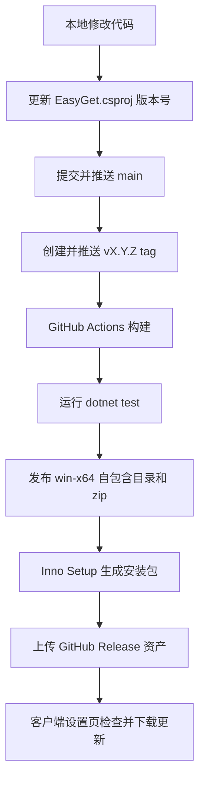

# EasyGet 发布与本地更新手册

## 总览

EasyGet 的正式发布链路和 VideoTracker 保持同一思路：本地提交版本号和代码，推送 `v*` tag，GitHub Actions 自动构建 Windows 安装包，并把安装包上传到 GitHub Releases。客户端在设置页检查 GitHub 最新 Release，下载安装包后由用户启动覆盖安装。



## Release 资产

每个正式版本会上传三类资产：

- `EasyGet-Setup-vX.Y.Z.exe`：安装版安装包。
- `EasyGet-win-x64-Release.zip`：便携 zip。
- `easyget-update.json`：版本、tag、资产名和大小的轻量 manifest。

## 本地构建

只发布 zip：

```powershell
powershell -NoProfile -ExecutionPolicy Bypass -File .\scripts\publish-win-x64.ps1 -Version 1.1.7
```

构建安装包：

```powershell
powershell -NoProfile -ExecutionPolicy Bypass -File .\scripts\build-installer.ps1 -Version 1.1.7
```

`build-installer.ps1` 需要本机安装 Inno Setup 6，并会复用 `publish-win-x64.ps1` 先生成发布目录。
构建完成后会在 `artifacts\publish\Release\` 下同时生成安装包、便携 zip 和 `easyget-update.json`。

## GitHub 自动发布

```powershell
git add .
git commit -m "chore: release v1.1.7"
git push origin main
git tag -a v1.1.7 -m "EasyGet v1.1.7"
git push origin v1.1.7
```

推送 tag 后，`.github/workflows/release.yml` 会在 `windows-latest` 上构建并创建 GitHub Release。

## 客户端更新

1. 打开 EasyGet 设置页。
2. 在「版本与更新」点击「检查新版本」。
3. 如果 GitHub 最新 Release 高于本地版本，点击「下载更新包」。
4. 下载完成后点击「安装更新」。
5. EasyGet 会启动安装包并退出，安装器负责覆盖安装。

当前实现不会静默安装，也不会在退出时自动替换文件；这是为了避免本地调试版或便携版被意外覆盖。

更新下载和安装器启动的诊断日志位于 `%LocalAppData%\EasyGet\logs\update.log`，用于排查 `.download` 临时文件、最终安装包、运行路径和版本号是否一致。
