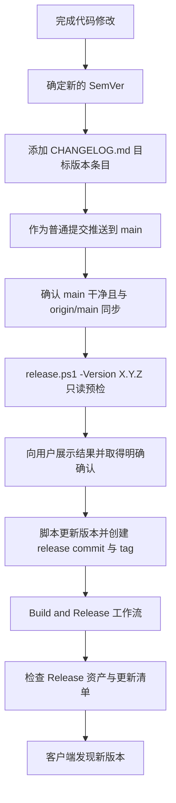

# EasyGet 发布与本地更新手册

## 唯一正式发布流程

正式版本只能通过仓库根目录的 `scripts/release.ps1` 发布。不要为发布手工修改 `EasyGet.csproj`，不要手工创建、移动或推送 tag，也不要直接调用 `gh release create/edit/delete`。脚本负责统一校验、版本修改、测试、release commit、tag、原子推送、GitHub Actions 等待和发布结果检查。

正式发布严格分为两个阶段：

```powershell
# 第一阶段：默认只读预检，预览版本修改，不创建 commit/tag、不推送
./scripts/release.ps1 -Version 1.4.3

# 第二阶段：向用户展示预检结果并取得明确确认后，才允许执行
./scripts/release.ps1 -Version 1.4.3 -Publish
```

也可以显式添加 `-DryRun` 表示只读预检。`-SkipTests` 只允许在同一个发布候选已经通过完整 Release 测试时使用，并且必须保留并说明测试证据；常规发布不要跳过测试。


```mermaid
graph TD
    A["完成代码修改"] --> B["确定新的 SemVer"]
    B --> C["添加 CHANGELOG.md 目标版本条目"]
    C --> D["作为普通提交推送到 main"]
    D --> E["确认 main 干净且与 origin/main 同步"]
    E --> F["release.ps1 -Version X.Y.Z 只读预检"]
    F --> G["向用户展示结果并取得明确确认"]
    G --> H["脚本更新版本并创建 release commit 与 tag"]
    H --> I["Build and Release 工作流"]
    I --> J["检查 Release 资产与更新清单"]
    J --> K["客户端发现新版本"]
```

## 发布前硬性条件

执行 `-Publish` 前必须同时满足：

- 当前分支是 `main`。
- 工作区无未提交文件。
- 已 fetch 远端，且本地 `main` 与 `origin/main` 完全同步，既不 ahead 也不 behind。
- `EasyGet.csproj` 仍是当前版本；目标 `X.Y.Z` 必须是更高且未使用的新 SemVer，版本修改由脚本独占完成。
- `CHANGELOG.md` 已有非空的 `## X.Y.Z - YYYY-MM-DD` 版本条目。
- 远端不存在目标 `vX.Y.Z` tag，也不存在同名 GitHub Release。
- GitHub 仓库级 Immutable releases 保持启用，发布脚本能够通过 API 验证。
- GitHub 已注册 `.github/workflows/release.yml`，且该 workflow 处于 active 状态。
- Release 测试通过。

目标版本的 changelog 和全部待发布内容应先作为普通 `main` 提交推送。不要提前修改项目版本；待 CI 通过、工作区重新回到干净同步状态后执行预检。取得用户确认后，`-Publish` 才会修改 `EasyGet.csproj`，创建 `chore: release vX.Y.Z` commit 和 annotated tag，并把 `main` 与 tag 一起推送。

## 标签不可变规则

一旦 `v*` tag 推送到 GitHub，它就是永久发布标识：

- 禁止删除、强制移动、覆盖或复用已经发布的 tag。
- 禁止把已有版本重新指向更新的 commit。
- 已发布版本出现任何问题，都必须修复到 `main`，更新版本和 changelog，然后发布新的 SemVer。
- 例如 `v1.4.2` 发布后需要补救，最小的新版本是 `v1.4.3`，不能重发 `v1.4.2`。

这条规则同时保护 GitHub Release、`easyget-update.json`、安装包校验值和客户端“最新版本”判断，避免它们指向不同 commit。

### 仓库级不可变发布保护

本仓库已于 2026-07-31 启用 GitHub `Immutable releases`。该设置只保护启用后创建的正式 Release：Release 一旦公开，其关联 tag 和资产都会被 GitHub 锁定，不能删除、移动或替换。不要关闭这项设置。

发布前可以使用下面的只读命令核对：

```powershell
gh api `
  -H "Accept: application/vnd.github+json" `
  -H "X-GitHub-Api-Version: 2026-03-10" `
  repos/zzf-857/EasyGet/immutable-releases
```

期望结果包含 `"enabled": true`。统一发布脚本会自动执行同等检查；发布 Action 还会验证最终 Release 返回 `immutable: true`。

## 普通推送不等于发布

普通代码或文档推送固定执行：检查并隔离其他任务的工作区改动、运行对应测试、只暂存本任务文件或 hunk、创建普通提交、只推送目标分支，然后等待该 commit SHA 对应的 `Build and Package` 成功。在共享脏工作区中禁止使用 `git add .`。

普通推送只更新 `main`，不修改 `EasyGet.csproj` 版本，不创建 tag，也不会让客户端收到新版本。只有用户明确要求正式发布、只读预检通过，并再次确认 `-Publish` 后，才进入发布流程。用于准备下个版本的 `CHANGELOG.md` 条目可以随普通提交推送，项目版本仍由发布脚本独占修改。

## Release 资产

每个正式版本会上传四类资产：

- `EasyGet-Setup-vX.Y.Z.exe`：安装版安装包。
- `EasyGet-win-x64-Release.zip`：便携 zip。
- `easyget-update.json`：版本、tag、资产名、大小和 SHA-256 的轻量 manifest。
- `EasyGet-vX.Y.Z.spdx.json`：由 Microsoft SBOM Tool 生成的 SPDX 2.2 软件物料清单。

## 本地打包验证

只发布 zip：

```powershell
powershell -NoProfile -ExecutionPolicy Bypass -File .\scripts\publish-win-x64.ps1
```

构建安装包：

```powershell
powershell -NoProfile -ExecutionPolicy Bypass -File .\scripts\build-installer.ps1
```

`build-installer.ps1` 需要本机安装 Inno Setup 6，并会复用 `publish-win-x64.ps1` 先生成发布目录。
构建完成后会在 `artifacts\publish\Release\` 下同时生成安装包、便携 zip 和 `easyget-update.json`。

这些底层脚本只用于本地验证产物；它们不代表完成正式发布。正式发布仍只能执行 `scripts/release.ps1`。

## GitHub 自动发布与完成标准

`scripts/release.ps1 -Publish` 创建并推送全新的 tag 后，`.github/workflows/release.yml` 会在 `windows-latest` 上构建并创建 GitHub Release。Agent 必须等待工作流结束，不能在 queued 或 in progress 时宣称发布完成。

发布成功必须验证：

- tag 触发的 `Build and Release` workflow 成功。
- GitHub Release 为公开、非 Draft、`immutable: true`；正常正式版应成为 Latest。
- Release 同时包含 `EasyGet-Setup-vX.Y.Z.exe`、`EasyGet-win-x64-Release.zip`、`easyget-update.json` 和 `EasyGet-vX.Y.Z.spdx.json`。
- `easyget-update.json` 中的 `version`、`tag`、资产名、大小和 SHA-256 与本次产物一致。
- 发布后冒烟检查确认 `https://github.com/zzf-857/EasyGet/releases/latest/download/easyget-update.json` 已返回新版本，客户端设置页能发现更新。

如果 workflow 失败，不得删除或移动已经推送的 tag。修复原因后发布下一个版本，并在结果中明确说明失败 job 和新版本号。

### Windows 代码签名

仓库同时配置以下两个 GitHub Actions Secrets 时，Release workflow 会签署 EasyGet 自有可执行文件，重新生成便携包和安装包，验证 Authenticode 签名，再刷新 `easyget-update.json` 的大小和 SHA-256：

- `WINDOWS_CODE_SIGNING_CERTIFICATE_BASE64`：PFX 证书文件的 Base64 内容。
- `WINDOWS_CODE_SIGNING_CERTIFICATE_PASSWORD`：PFX 密码。

可以在本地生成第一个 Secret 的值：

```powershell
[Convert]::ToBase64String([IO.File]::ReadAllBytes("C:\secure\easyget-code-signing.pfx"))
```

两个 Secret 都不存在时，workflow 会明确记录产物未签名并继续发布；只配置其中一个时会终止发布，避免把不完整配置误认为已签名。证书由项目维护者向可信代码签名证书提供商申请，仓库和 workflow 不会生成或伪造发布证书。

### SBOM 与产物证明

SBOM 生成后，workflow 使用 GitHub 官方 `actions/attest` 分别为 Release 资产创建构建来源证明和 SBOM 证明。这些基于 GitHub OIDC 的证明用于确认产物来自指定 workflow，不等同于 Windows Authenticode 代码签名。

下载 Release 资产后可以验证其 GitHub 证明：

```powershell
gh attestation verify .\EasyGet-Setup-vX.Y.Z.exe --repo zzf-857/EasyGet
gh attestation verify .\EasyGet-win-x64-Release.zip --repo zzf-857/EasyGet
```

## 客户端更新

1. 打开 EasyGet 设置页。
2. 在「版本与更新」点击「检查新版本」。
3. 客户端读取最新 Release 的静态 `easyget-update.json`；如果版本高于本地版本，点击「下载更新包」。
4. 下载完成后点击「安装更新」。
5. EasyGet 会启动安装包并退出，安装器负责覆盖安装。

当前实现不会静默安装，也不会在退出时自动替换文件；这是为了避免本地调试版或便携版被意外覆盖。
检查更新不会调用 GitHub Releases REST API，因此不会占用匿名 API 的共享限额；安装包只有在大小和 SHA-256 均与清单一致后才会替换旧的下载文件。

更新下载和安装器启动的诊断日志位于 `%LocalAppData%\EasyGet\logs\update.log`，用于排查 `.download` 临时文件、最终安装包、运行路径和版本号是否一致。
