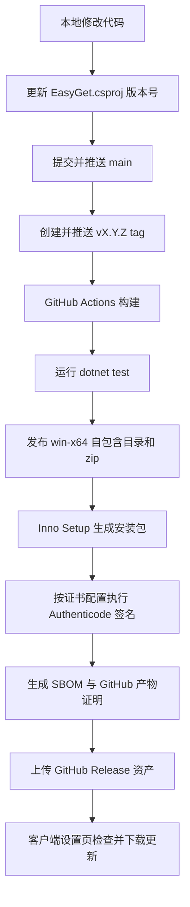

# EasyGet 发布与本地更新手册

## 总览

EasyGet 的正式发布链路和 VideoTracker 保持同一思路：本地提交版本号和代码，推送 `v*` tag，GitHub Actions 自动构建 Windows 安装包，并把安装包上传到 GitHub Releases。客户端在设置页检查 GitHub 最新 Release，下载安装包后由用户启动覆盖安装。


```mermaid
graph TD
    A["本地修改代码"] --> B["更新 EasyGet.csproj 版本号"]
    B --> C["提交并推送 main"]
    C --> D["创建并推送 vX.Y.Z tag"]
    D --> E["GitHub Actions 构建"]
    E --> F["运行 dotnet test"]
    F --> G["发布 win-x64 自包含目录和 zip"]
    G --> H["Inno Setup 生成安装包"]
    H --> I["按证书配置执行 Authenticode 签名"]
    I --> J["生成 SBOM 与 GitHub 产物证明"]
    J --> K["上传 GitHub Release 资产"]
    K --> L["客户端设置页检查并下载更新"]
```

## Release 资产

每个正式版本会上传四类资产：

- `EasyGet-Setup-vX.Y.Z.exe`：安装版安装包。
- `EasyGet-win-x64-Release.zip`：便携 zip。
- `easyget-update.json`：版本、tag、资产名、大小和 SHA-256 的轻量 manifest。
- `EasyGet-vX.Y.Z.spdx.json`：由 Microsoft SBOM Tool 生成的 SPDX 2.2 软件物料清单。

## 本地构建

只发布 zip：

```powershell
powershell -NoProfile -ExecutionPolicy Bypass -File .\scripts\publish-win-x64.ps1 -Version 1.2.0
```

构建安装包：

```powershell
powershell -NoProfile -ExecutionPolicy Bypass -File .\scripts\build-installer.ps1 -Version 1.3.0
```

`build-installer.ps1` 需要本机安装 Inno Setup 6，并会复用 `publish-win-x64.ps1` 先生成发布目录。
构建完成后会在 `artifacts\publish\Release\` 下同时生成安装包、便携 zip 和 `easyget-update.json`。

## GitHub 自动发布

```powershell
git add .
git commit -m "chore: release v1.2.0"
git push origin main
git tag -a v1.2.0 -m "EasyGet v1.2.0"
git push origin v1.2.0
```

推送 tag 后，`.github/workflows/release.yml` 会在 `windows-latest` 上构建并创建 GitHub Release。

### Windows 代码签名

仓库同时配置以下两个 GitHub Actions Secrets 时，Release workflow 会签署 EasyGet 自有可执行文件，重新生成便携包和安装包，验证 Authenticode 签名，再刷新 `easyget-update.json` 的大小和 SHA-256：

- `WINDOWS_CODE_SIGNING_CERTIFICATE_BASE64`：PFX 证书文件的 Base64 内容。
- `WINDOWS_CODE_SIGNING_CERTIFICATE_PASSWORD`：PFX 密码。

可以在本地生成第一个 Secret 的值：

```powershell
[Convert]::ToBase64String([IO.File]::ReadAllBytes("C:\secure\easyget-code-signing.pfx"))
```

两个 Secret 都不存在时，workflow 会明确记录产物未签名并继续发布；只配置其中一个时会终止发布，避免把不完整配置误认为已签名。证书由项目维护者向可信代码签名证书提供商申请，仓库和 workflow 不会生成或伪造发布证书。

### SBOM 与产物证明

SBOM 生成后，workflow 使用 GitHub 官方 `actions/attest` 分别为 Release 资产创建构建来源证明和 SBOM 证明。这些基于 GitHub OIDC 的证明用于确认产物来自指定 workflow，不等同于 Windows Authenticode 代码签名。

下载 Release 资产后可以验证其 GitHub 证明：

```powershell
gh attestation verify .\EasyGet-Setup-vX.Y.Z.exe --repo zzf-857/EasyGet
gh attestation verify .\EasyGet-win-x64-Release.zip --repo zzf-857/EasyGet
```

## 客户端更新

1. 打开 EasyGet 设置页。
2. 在「版本与更新」点击「检查新版本」。
3. 客户端读取最新 Release 的静态 `easyget-update.json`；如果版本高于本地版本，点击「下载更新包」。
4. 下载完成后点击「安装更新」。
5. EasyGet 会启动安装包并退出，安装器负责覆盖安装。

当前实现不会静默安装，也不会在退出时自动替换文件；这是为了避免本地调试版或便携版被意外覆盖。
检查更新不会调用 GitHub Releases REST API，因此不会占用匿名 API 的共享限额；安装包只有在大小和 SHA-256 均与清单一致后才会替换旧的下载文件。

更新下载和安装器启动的诊断日志位于 `%LocalAppData%\EasyGet\logs\update.log`，用于排查 `.download` 临时文件、最终安装包、运行路径和版本号是否一致。
